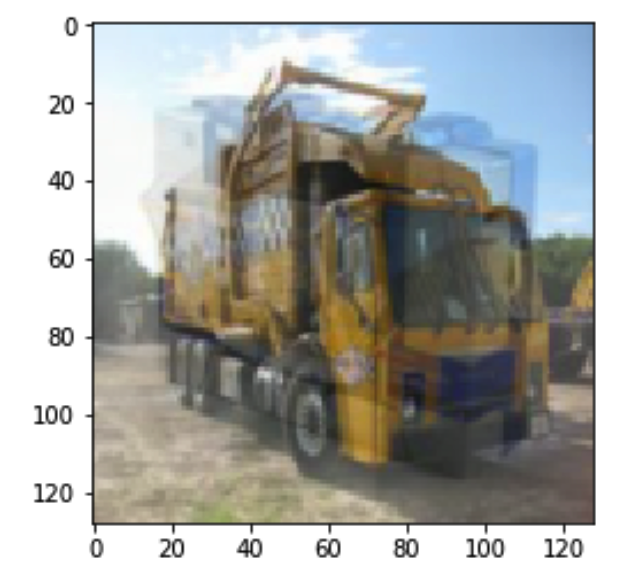
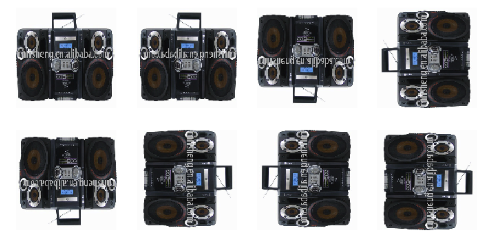
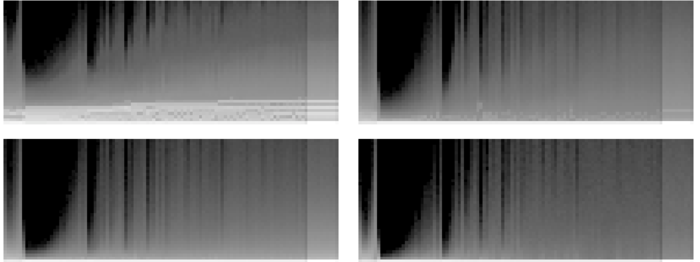
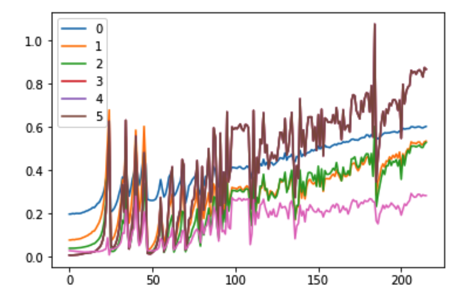

Computer Vision - Basics to SOTA - everything needed to build a SOTA architecture (Xresnet) from scratch on a computer vision task.

Project incldues:

* Optimizing (speed wise) regular training loops with broadcasting * Callbacks Architecture
* Deep dive into the model's stats (avgs, stds) using hooks
* Batchorm, optimizers
* Building a datablock API to: load files, split into train/valid, label, transform, turn into a Dataloader
* Xresnet model based on [Bag of tricks paper](http://openaccess.thecvf.com/ content_CVPR_2019/papers/ He_Bag_of_Tricks_for_Image_Classification_with_Convolutional_Neural_Networks _CVPR_2019_paper.pdf)
* Using the self built model as a transfer learning model to another dataset
* Gradual freezing/discriminative learning rates

Examples:
Mixup augmentation - 

FlipAugmentation - 

Hooking to activations - 

Hooking to averages - 
